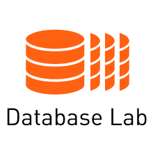

# Database Lab - Thin clones for faster development
Boost your development process

<div align="center">
    
</div>

## Install

*Currently, there are no ready-to-use binaries or a Docker image. The setup
is to be done using the source code.*

1. Get the source code: `git clone https://gitlab.com/postgres-ai/db-lab.git`.
1. Golang is required.
    - Ubuntu: In some cases, standard Ubuntu package might not work. See
https://gitlab.com/postgres-ai/db-lab/snippets/1918769.
    - On macOS: `brew install golang`
1. Install ZFS (Ubuntu: https://gitlab.com/postgres-ai/db-lab/snippets/1918768).

### ZFS Store
1. Create a ZFS store with a clone of
the production Postgres database (e.g. using WAL-E, WAL-G or Barman archive).
1. Shutdown Postgres, create a new ZFS snapshot
(`sudo zfs snapshot -r  zpool@db_state_1`) and remember its name. It will
be needed for further configuration (`initialSnapshot` option in
`config/config.yml`).
1. Start Postgres.


## Run
Deploy a Database Lab instance in your infrastructure. You would need to:
1. Create `config/config.yml` (see example in `config/`).
1. Build `make all` and launch Database Lab with some token for REST API
authorization `./bin/dblab -v some-token`
(or, with log: `./bin/dblab -v some-token 2>&1 | tee -a dblab.log`).


## Usage
### Check connection availability
Access your Database Lab instance and check its status performing `GET /status`
HTTP request.
```bash
curl -X GET -H "Verification-Token: some-token" -i https://host/status
```

If the Database Lab instance is functioning normally, you will get the status
code `OK`, and the response will have the following format:
```json
{
  "status": {
    "code": "OK",
    "message": "Instance is ready"
  },
  ...
}
```

### Request clone creation
When your Database Lab instance is up and running you can use it to create thin
clones, work with them, delete the existing clones, and see the list of
existing clones. To create a thin clone, you need to make a `POST /clone`
request and fill all the required fields, as illustrated below:

```bash
curl -X POST -H "Verification-Token: some-token" \
  -d '{"name":"clone1", "db":{"username":"new_user", "password":"some_password"}}' \
  -i https://host/clone
```

We will get clone ID and status `CREATING`, we should make consequential
`GET /status` and wait until status became `OK`.
```json
{
  "id": "bo200eumq8of32ck5e2g",
  "name": "clone1",
  "status": {
    "code": "CREATING",
    "message": "Clone is being created."
  },
  "db": {
    "host": "internal_host",
    "port": "6000",
    "username": "new_user"
  },
  ...
}
```

### Connect
When the status is `OK` we are ready to connect to the clone's Postgres
database. For example, using `psql`:
```bash
psql -h internal_host -p 6000 -U new_user # will ask for a password unless it's set in either PGPASSWORD or .pgpass
```


## REST API

Instance statuses:
- `OK` - instance functions well.
- `WARNING` - still functional, but have some problems, e.g. disk space shortage, insecure connection (upcoming MRs).

Clone statuses:
- `OK` - clone is ready to accept postgres connections.
- `CREATING` - clone is being created.
- `DELETING` - clone is being deleted.
- `FATAL` - fatal error happened (details in status message).

Models:
```
Clone
{
  id: "xxx",
  status: {
    code: "OK",
    message: "Database is ready"
  },
  project: "proj1"
  snapshot: "" (optional, ID or timestamp)
  db: {
    username: "postgres"
    password: "" (never set on DB Lab side)
    host: "xxx",
    port: "xxx",
    connStr: "xxx"
  },
  protected: true
  deleteAt: "" (timestamp),
  name: "",
  username: "",
  createdAt: ""
}

Error
{
  code: "NOT_ENOUGH_DISK_SPACE",
  name: "Not enough disk space",
  hint: "Stop idle clones, change snapshot policy or increase disk size"
}
```

API routes:
```
Get DB Lab instance status and list clones
GET /status
Response:
{
  status: {
    code: "OK",
    message: "DB Lab is ready"
  },
  disk: {
    size: 1000.0, (bytes)
    free: 1200.0
  },
  expectedCloningTime: 8.0, (secondss)
  numClones: 10,
  clones: [{
    id: "id"
    status: {
      code: "OK",
      message: "Database is ready"
    },
    ...
  }, ... ],
 snapshots: [{
   id: "xxx",
   timestamp: "123"
 }, ... ]
}

Create a clone
POST /clone/
Request:
{
  project: "proj1",
  snapshot: (optional): "",
  db: {
    username: "xxx",
    password: "xxx"
  }
  username: "xxx",
  name: "xxx"
}
Response:
{
  id: "xxx"
}

Update a clone
PATCH /clone/:id

Reset a clone
POST /clone/:id/reset

Delete a clone
DELETE /clone/:id

Get status of a clone
GET /clone/:id
Response:
{
  id: "xxx",
  status: {
    code: "OK",
    message: "Database clone is ready"
  },
  cloneSize: 1000.0,
  cloningTime: 5,
  project: "xxx",
  snapshot: "xxx",
  db: {
    username: "xxx",
    host: "xxx",
    port: "xxx",
    connStr: "xxx"
  },
  protected: true,
  deleteAt: "",
  name: "xxx",
  username: "xxx",
  createdAt: "123"
}
```
