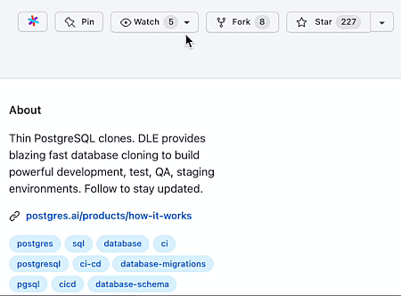

# Database Lab - Thin database clones for faster development


Database Lab allows superfast cloning of large databases to solve the following problems:

- help build development and testing environments involving full-size database,
- provide temporary full-size database clones for SQL query optimization (see also:
[Joe bot](https://gitlab.com/postgres-ai/joe), which works on top of Database Lab),
- help verify database migrations (DB schema changes) and massive data operations.

As an example, the cloning of 10 TiB PostgreSQL database takes less than 2 seconds.

In rapidly developing businesses, excellent production health requires powerful non-production environments.
With Database Lab, provisioning of multi-terabyte database clones doesn't imply much
waiting time or extra budgets spent anymore. Therefore, Database Lab gives necessary power to developers, DBAs,
and QA engineers, boosting development and testing processes.

## Status

The project is in its early stage. However, it is already being extensively used
in some teams in their daily work. Since production is not involved, it is
quite easy to try and start using it.

Please support the project giving a GitLab star (it's on [the main page](https://gitlab.com/postgres-ai/database-lab),
at the upper right corner):



To discuss Database Lab, try a demo, or ask any questions,
[join our community Slack](https://database-lab-team-slack-invite.herokuapp.com/).

## Workflow overview and requirements

**TL;DR:** you need:
- any machine with a separate disk that is big enough to store a single copy of your database,
- Linux with Docker and ZFS,
- initial copy of your Postgres database.

Details:
- for each Database Lab instance, a separate machine (either physical or virtual) is needed,
- both on-premise and cloud setups are possible,
- for each Postgres cluster (a single Postgres server with databases), a separate Database Lab instance is required,
- the machine needs to have a separate disk partition with size enough to store the target Postgres directory (PGDATA),
- any modern Linux is supported,
- Docker needs to be installed on the machine,
- currently, you need to take care yourself of the initial copying of the database to this disk ("thick cloning" stage),
use pg_basebackup, restoration from an archive (such as WAL-G, Barman, pgBackRest or any), or dump/restore (the only way
supported for RDS, until AWS guys decide to allow replication connections),
- upon request, Database Lab will do "thin cloning" of PGDATA, providing fully independent writable
Postgres clones to users;
- currently, the only technology supported for thin cloning is ZFS,
so [ZFS on Linux](https://zfsonlinux.org/) needs to be installed on the machine,
- however, it is easy to extend and add, say, LVM or Ceph - please write us if you
need it; also, contributions are highly welcome).

## Getting started
See [detailed tutorial](https://postgres.ai/docs/database-lab/1_tutorial)
in our documentation.

## Client CLI installation

*Currently, there are no ready-to-use binaries for CLI. The setup
is to be done using the source code.* <!-- TODO: we need to ship binaries, at least for Linux, better Linux + MacOS -->

1. Get the source code: `git clone https://gitlab.com/postgres-ai/db-lab.git`.
1. Golang is required.
    - Ubuntu: In some cases, standard Ubuntu package might not work. See
https://gitlab.com/postgres-ai/db-lab/snippets/1918769.
    - On macOS: `brew install golang`
1. Clone Database Lab repo and build it:
``` bash
git clone https://gitlab.com/postgres-ai/database-lab.git
cd ./database-lab
make all
```

## Usage
Once you have Database Lab server(s) intalled, and client CLI installed on your machine,
initialize CLI and start communicating with the Database Lab server(s).

### Initialize CLI tool
```bash
./bin/dblab init --environment_id dev1 --url https://HOST --token TOKEN
```

### Check connection availability
Access your Database Lab instance and check its status.
```bash
./bin/dblab instance status
```

If the Database Lab instance is functioning normally, we will get the status
code `OK`, and the response will have the following format:
```json
{
  "status": {
    "code": "OK",
    "message": "Instance is ready"
  },
  ...
}
```

### Request clone creation
When your Database Lab instance is up and running you can use it to create thin
clones, work with them, delete the existing clones, and see the list of
existing clones. To create a thin clone, you need to execute a `dblab clone create`
and fill all the required options, as illustrated below:

```bash
./bin/dblab clone create --username dblab_user1 --password secret
```

We will get clone ID and status `CREATING`, we should execute consequential
`./bin/dblab instance status` and wait until status became `OK`.
```json
{
  "id": "bo200eumq8of32ck5e2g",
  "status": {
    "code": "OK",
    "message": "Clone is ready to accept connections."
  },
  "db": {
    "host": "internal_host",
    "port": "6000",
    "username": "dblab_user1"
  },
  ...
}
```

### Connect
When the status is `OK` we are ready to connect to the clone's Postgres
database. For example, using `psql`:
```bash
psql -h internal_host -p 6000 -U dblab_user1 # will ask for a password unless it's set in either PGPASSWORD or .pgpass
```

## Community
- [Community Slack (English)](https://database-lab-team-slack-invite.herokuapp.com/)
- [Telegram (Russian)](https://t.me/databaselabru)

## Development requirements

1. Install `golangci-lint`: https://github.com/golangci/golangci-lint#install
<!-- TODO: SDK docs -->
<!-- TODO: Contribution guideline -->
